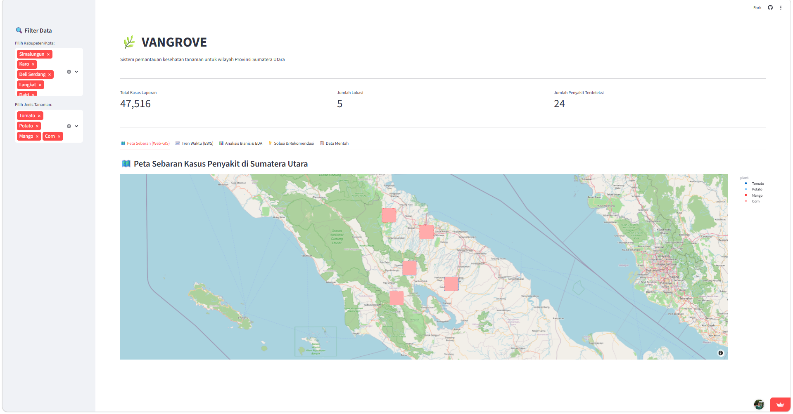

# VANGROVE

**VANGROVE (Visual Analytics & Navigation for Geographic Regional Output & Variety Evaluation)**

---

## Dashboard Preview



## Tech Stack

* Python
* Streamlit
* Plotly
* Pandas
* NumPy
* KaggleHub
* OpenStreetMap

---

## Struktur Repositori

```plaintext
Data-Science/
│
├── ab_testing/
│   ├── ab_testing_dashboard_analysis.ipynb
│   └── ab_testing_dashboard_analysis.py
│
├── dashboard/
│   ├── app.py
│   ├── app_B.py
│   └── cleaned_dataset_final.csv
│
├── data/
│
├── README.md
├── base_dataset.csv
├── data_preparation_balancing.ipynb
├── dataset_extraction.ipynb
├── feature_engineering.ipynb
├── requirements.txt
└── url.txt
```

### Penjelasan File

dashboard/app.py -> Dashboard utama berbasis Streamlit dan Plotly<br>
dashboard/app_B.py -> Variasi dashboard untuk kebutuhan pengujian A/B Testing<br>
dashboard/cleaned_dataset_final.csv -> Dataset akhir hasil feature engineering yang digunakan untuk dashboard dan analisis<br>
data_preparation_balancing.ipynb -> Tahap preprocessing dan balancing<br>
dataset_extraction.ipynb -> Tahap ekstraksi dataset<br>
feature_engineering.ipynb -> Tahap penambahan metadata sintetis, geolokasi, waktu simulatif, kondisi agronomis, rekomendasi, dan EDA<br>
ab_testing_dashboard_analysis.ipynb -> Analisis pengujian dashboard menggunakan pendekatan A/B Testing<br>
url.txt → Kumpulan tautan penting project seperti dashboard, laporan, dan dataset<br>

---

## Fitur Dashboard

### 🗺️ Peta Sebaran Web-GIS

Visualisasi geografis interaktif kasus penyakit tanaman pada wilayah Provinsi Sumatera Utara menggunakan Plotly dan OpenStreetMap

### 📈 Tren Waktu (EWS)

Grafik tren bulanan interaktif untuk memantau lonjakan kasus penyakit tanaman dan mendeteksi potensi wabah secara dini

### 📊 Analisis Bisnis & EDA

Dashboard menyediakan visualisasi proporsi tanaman, distribusi penyakit, dan sebaran kasus berdasarkan wilayah

### 💡 Solusi & Rekomendasi

Sistem memberikan rekomendasi agronomis berdasarkan jenis penyakit dan kondisi lingkungan yang terdeteksi

---

## Cara Menjalankan Dashboard Secara Lokal

### 1. Clone Repository

```bash
git clone https://github.com/VANGROVEE/Data-Science.git
cd Data-Science
```

### 2. Buat dan Aktifkan Virtual Environment

#### Windows (PowerShell)

```bash
python -m venv venv
.\venv\Scripts\Activate.ps1
```

#### Mac/Linux

```bash
python3 -m venv venv
source venv/bin/activate
```

### 3. Install Dependencies

```bash
pip install -r requirements.txt
```

### 4. Jalankan Dashboard Streamlit

```bash
streamlit run dashboard/app.py
```

---

## Deployment

Dashboard dapat diakses melalui Streamlit Cloud:

```txt
https://dashboardvangrove.streamlit.app/
```

---

## Dataset

Dataset pada project ini menggunakan dataset hasil preprocessing yang telah dipublikasikan melalui Kaggle untuk kebutuhan integrasi pipeline data dan pengembangan dashboard VANGROVE

Pada tahap feature engineering, dataset diperkaya dengan metadata sintetis seperti geolokasi wilayah Sumatera Utara, waktu simulatif, kondisi agronomis, serta rekomendasi penanganan penyakit tanaman

Hasil akhir proses feature engineering disimpan dalam file `cleaned_dataset_final.csv`

Dataset Kaggle:
https://www.kaggle.com/datasets/pppiiiy/data-science-data

> **Catatan:**  
> Sitasi sumber dataset asli yang digunakan dalam proses preprocessing dapat dilihat pada bagian sitasi Kaggle/lampiran laporan teknis

---

## Useful Links

* Dashboard Streamlit: https://dashboardvangrove.streamlit.app/
* Laporan Teknis: soon
* Dataset Kaggle: https://www.kaggle.com/datasets/pppiiiy/data-science-data
* Repository GitHub: https://github.com/VANGROVEE/Data-Science.git

---

## VANGROVE Team

Data Scientist Team